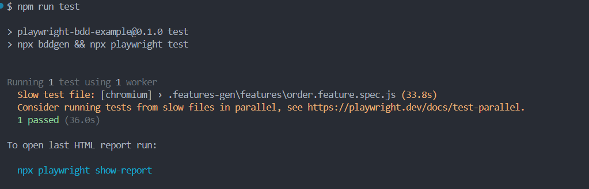
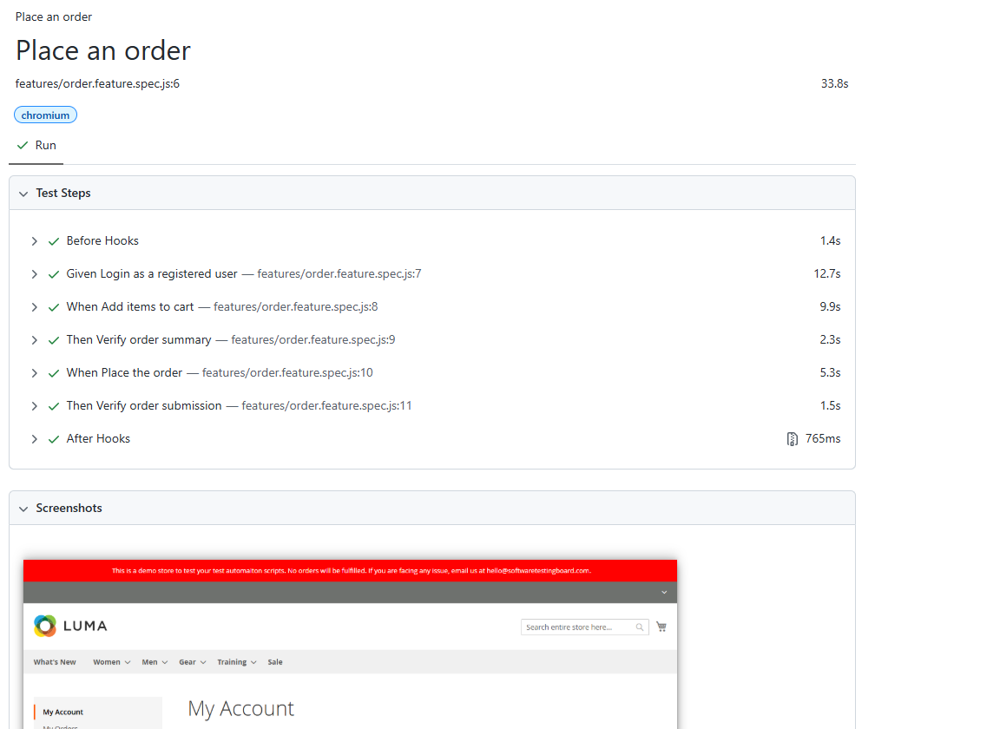
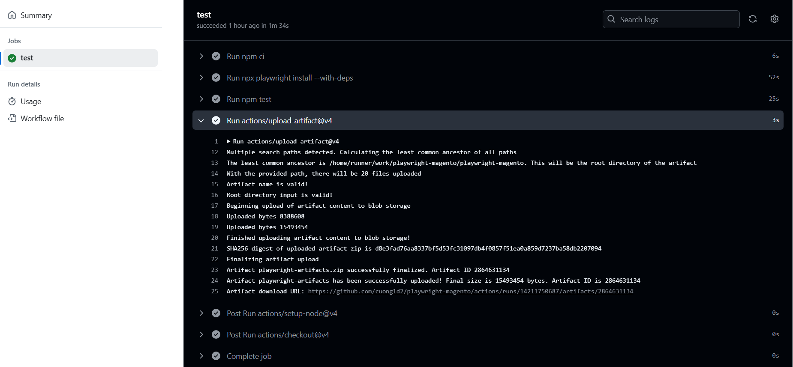

1. Install dependencies

   ```
   npm install
   ```

2. Install browsers

   ```
   npx playwright install
   ```

3. Run tests

   ```
   npm test
   ```
4. Test result in console



5. Test result in html report



6. Result in GitHub Action

